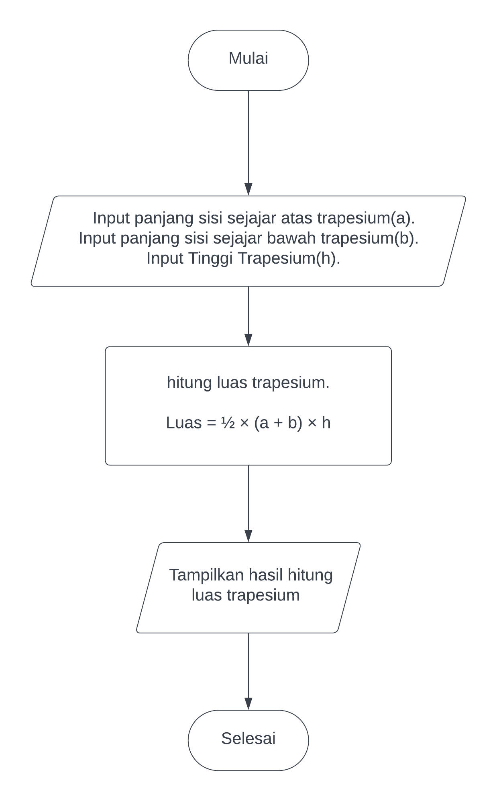

1. Sebutkan berbagai bahasa pemrograman yang bisa digunakan untuk mengembangkan aplikasi backend!
    - Java
    - Golang
    - PHP
    - Python

    Referensi : https://www.hostinger.co.id/tutorial/bahasa-pemrograman#:~:text=Python%2C%20PHP%2C%20Go%2C%20dan,menjadi%20bahasa%20yang%20paling%20cocok.

2. Sebutkan dan jelaskan berbagai teknologi yang perlu dipelajari untuk menjadi seorang backend engineer!
    - SQL
    - Bahasa pemrograman Backend
    - REST API
    - Framework
    - Unit Test

    Referensi : https://www.sekawanmedia.co.id/blog/menjadi-seorang-backend-developer/

3. Buatlah sebuah flowchart untuk menghitung luas trapesium.

